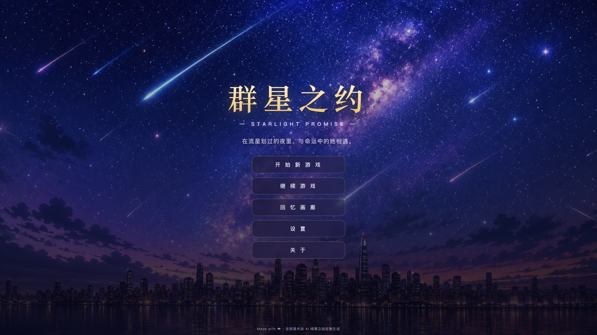
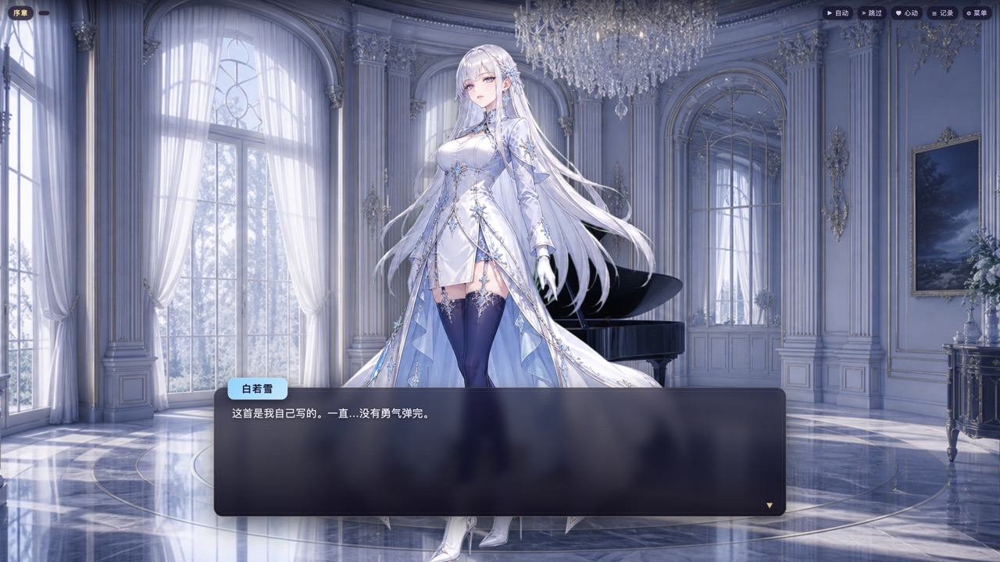
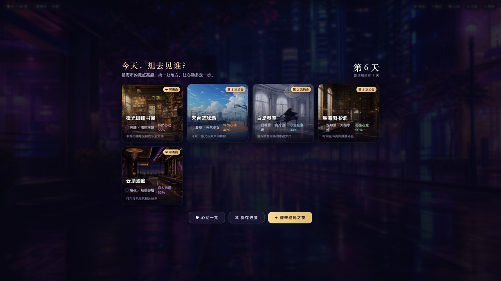
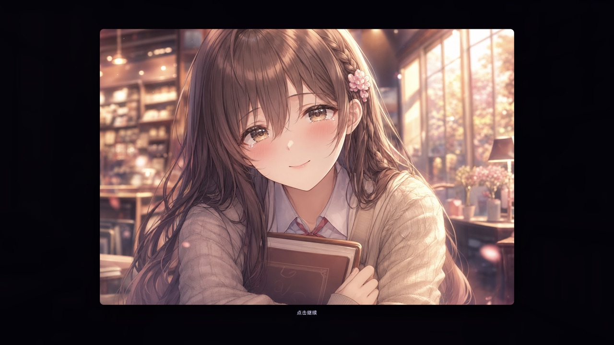

# 群星之约 · Starlight Promise

> 一款二次元恋爱视觉小说（galgame）。在「星海市」，与五位性格迥异的女孩相遇，用每一次选择，靠近一颗心。
> 纯前端、零依赖、可直接部署到 **GitHub Pages**。



| 立绘对话 | 约会中枢 |
| --- | --- |
|  |  |
| **结局 CG** | **结局演出** |
|  |  |

---

## ✨ 特色

- **五位风格鲜明的女主**，各有专属主题色、场景、剧情线与结局：
  | 角色 | 定位 | 关键词 | 三套装扮 |
  | --- | --- | --- | --- |
  | 苏晴 | 清纯学妹 | 书店 · 热可可 · 暗恋成真 | 校园制服 / 休闲约会 / 夏日浴衣 |
  | 夏葵 | 元气少女 | 篮球 · 阳光 · 拼尽全力 | 元气运动 / 街头休闲 / 夏日海风 |
  | 白若雪 | 高冷傲娇 | 钢琴 · 初雪 · 嘴硬心软 | 霜雪礼裙 / 柔蓝私服 / 初雪长裘 |
  | 沈知夏 | 知性学姐 | 图书馆 · 雨声 · 温柔治愈 | 学院知性 / 周末休闲 / 夏夜和服 |
  | 凌夜 | 魅惑御姐 | 顶楼酒廊 · 博弈 · 危险心动 | 夜色执掌 / 酒红晚礼 / 微醺私服 |
- **真 · 序列帧活体动画**：每套装扮都由「纯绿幕逐帧生成」——以上一帧为参考生成下一帧，再统一抠像、并集对齐、归一缩放，得到锚定一致的呼吸/摇摆序列帧；运行时按乒乓顺序交叉淡入播放，并叠加入场、说话浮动、情绪反应（雀跃 / 惊吓 / 点头 / 颤抖）。
- **每位女主 3 套装扮 × 多场景叙事**：每条线 5 段约会构成完整情感弧线，沿途切换不同装扮与外景（夏日祭、海岸、摩天轮、水族馆、河畔烟花、初雪、星空观测台……），15 套立绘 + 17 张场景原画。
- **完整 galgame 系统**：打字机对话、分支选项、好感度系统、约会中枢（天数 / 地点选择）、表白与多结局、自动播放 / 跳过、对话回放、存读档（6 槽 + 自动存档）、回忆画廊（多套立绘 + 场景原画 + 结局 CG）。
- **程序化音乐与音效**：背景音乐与所有音效均由 **Web Audio API 实时合成**（五声音阶 + 柔和音色 + 混响），不含任何外部音频文件。
- **零构建、零外部依赖**：纯 HTML + CSS + 原生 ES Module，使用相对路径，开箱即可部署到 GitHub Pages 子路径。

---

## 🎮 在本地运行

由于使用了 ES Module，需通过 HTTP 服务访问（不能直接 `file://` 打开）：

```bash
# 任选其一
python3 -m http.server 8000
# 然后浏览器打开 http://localhost:8000
```

**操作**：鼠标点击 / 空格 / 回车 推进对话；`Esc` 打开菜单；`Ctrl` 按住快进。

---

## 🎨 美术流水线：绿幕立绘 → 抠像 → 序列帧动画

这是本项目的核心制作流程，工具位于 `tools/`：

```
①  纯绿幕全身立绘：先生成基准帧，再「以上一帧为参考」生成呼吸/摇摆下一帧
    (anim_src/<角色>/<装扮>/0.png, 1.png, ……  ——  纯绿背景)
        │
        ▼   tools/make_anim.py  —— 帧动画抠像 + 并集对齐
②  锚定一致的透明序列帧 (assets/characters/<角色>/<装扮>/frame_00.webp …)
        │
        └─►  游戏运行时：多帧叠放，按乒乓顺序交叉淡入 (js/engine/stage.js)
             叠加入场 / 说话浮动 / 情绪反应等实时变换
```

> `tools/make_anim.py` 与单图抠像 `tools/chroma_key.py` 的区别：前者对**一组帧**取 alpha 包围盒的**并集**统一裁剪与缩放，保证逐帧之间人物锚定一致——这是干净帧动画的关键（避免抖动/错位）。

### 1) 帧动画抠像 + 对齐（核心）

```bash
# 把一套装扮的绿幕帧（按文件名为播放顺序）抠像并对齐，输出 webp 序列帧
python3 tools/make_anim.py anim_src/suqing/yukata -o assets/characters/suqing/yukata --height 1400 --webp
```
采样四角估计绿幕色 → `greenness = G - max(R,B)` 联合背景相似度计算软边 alpha → 去绿溢色(despill) →
羽化收边 → 形态学去噪剔除孤立绿斑 → 取**所有帧并集包围盒**统一裁剪 → 归一高度，输出锚定一致的透明序列帧。
单张立绘抠像仍可用 `tools/chroma_key.py`。

### 2) 发布优化（Web 提速）

为了在 GitHub Pages 上**秒开**，发布资源做了无损观感的格式优化（整套素材 ~41MB → ~10MB）：

```bash
# 人物：转 WebP（保留透明通道，体积约为 PNG 的 1/5）
cwebp -q 88 -alpha_q 95 assets/characters/char_suqing.png -o assets/characters/char_suqing.webp
# 背景 / CG：无需透明，转 JPEG
sips -s format jpeg -s formatOptions 86 assets/backgrounds/bg_cafe.png --out assets/backgrounds/bg_cafe.jpg
```

### 3) 精灵图烘焙（可选）

```bash
python3 tools/make_sprites.py assets/characters/char_suqing.png -o sprites --frames 24 --fps 12
```
把透明立绘烘焙成离线可直接播放的「呼吸 + 摇摆」精灵图 + JSON 元数据（演示用途）。

依赖：`Pillow`、`numpy`（`pip install pillow numpy`）。

---

## 🚀 部署到 GitHub Pages

### 方式 A：GitHub Actions（推荐，已内置）
1. 新建 GitHub 仓库并推送本项目。
2. 仓库 **Settings → Pages → Build and deployment → Source** 选择 **GitHub Actions**。
3. 推送到 `main` 分支即自动构建发布（见 `.github/workflows/deploy.yml`），
   发布地址形如 `https://<用户名>.github.io/<仓库名>/`。

### 方式 B：从分支根目录发布
1. **Settings → Pages → Source** 选择 `Deploy from a branch`，分支选 `main`，目录选 `/ (root)`。
2. 几十秒后即可访问。仓库已包含 `.nojekyll`，无需 Jekyll 处理。

> 所有资源均使用相对路径，子路径（`/<仓库名>/`）下可正常运行。

---

## 📁 目录结构

```
.
├── index.html              # 入口
├── css/style.css           # 全部样式与界面动画
├── js/
│   ├── main.js             # 启动、资源预载
│   ├── game.js             # 顶层流程控制器
│   ├── data/               # 角色 / 配置 / 剧本（内容数据）
│   └── engine/             # 引擎：舞台动画 / 对话运行时 / 中枢 / 界面 / 音频 / 存档
├── assets/
│   ├── characters/<角色>/<装扮>/frame_NN.webp   # 抠像对齐后的序列帧（游戏使用）
│   ├── characters_raw/     # 早期绿幕原始立绘
│   ├── backgrounds/        # 17 张场景背景
│   └── cg/                 # 结局 CG
├── anim_src/<角色>/<装扮>/ # 绿幕动画源帧（不入库、不发布；可重新生成）
├── tools/                  # make_anim.py / chroma_key.py / make_sprites.py
└── .github/workflows/      # GitHub Pages 部署
```

---

## 🛠 技术栈

原生 JavaScript（ES Module）· CSS3 · Web Audio API · Python（Pillow / numpy，仅离线美术流水线）。
无运行时第三方依赖，无需打包构建。

## 📜 致谢与说明

剧情、人物设定、世界观、界面与代码均为原创实现；全部美术由 AI 以「绿幕立绘」方式生成后，经本项目流水线抠像处理。仅供学习与演示。

— v2.0.0
